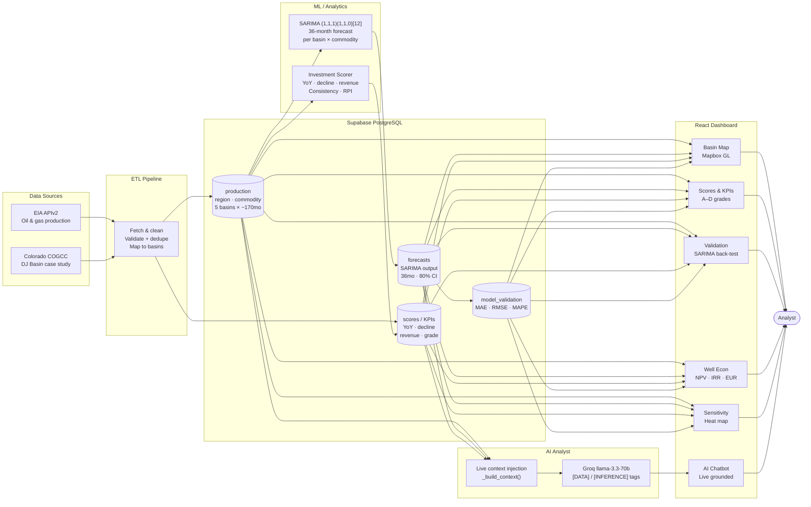

# Architecture Overview

## System Diagram



---

## Final Tech Stack

| Layer | Technology | Notes |
|-------|-----------|-------|
| **Frontend** | React 18 + Vite | SPA, no SSR needed; Vite gives instant HMR during dev |
| **State / data fetching** | `@tanstack/react-query` | Automatic caching, background refetch, loading/error states |
| **Charts** | `react-plotly.js` + custom SVG | Plotly for interactive charts; hand-rolled SVG for sparklines, radial gauges |
| **Mapping** | `react-map-gl` (Mapbox GL JS) | Deck.gl `ScatterplotLayer` + `GeoJsonLayer` for basin overlays |
| **Backend** | FastAPI + Uvicorn | REST API; 14 endpoints covering production, forecasts, KPIs, AI, well economics, sensitivity |
| **Database** | Supabase (PostgreSQL) | Managed Postgres; row-level filtering pushed to DB rather than client |
| **Forecasting** | `statsmodels` SARIMA(1,1,1)(1,1,0)[12] | Seasonal ARIMA fit per region/commodity pair |
| **AI** | Groq SDK — `llama-3.3-70b-versatile` | Low-latency inference; context-injected with live KPI snapshot on every request |
| **Data ingestion** | EIA Open Data API + COGCC (Colorado) | `requests` + `python-dotenv`; stored to Supabase at run-time |
| **Env management** | `python-dotenv` | `.env` for local; dashboard env vars for hosting |

**Original plan used:** Streamlit, DuckDB, Prophet, LangChain, OpenAI GPT-4o. See [What Changed](#what-changed-from-the-plan) below.

---

## Folder Structure

```
energy-intelligence-system/
├── api/
│   └── main.py               # All 14 FastAPI endpoints + SARIMA engine + well-econ math
├── src/
│   └── data/
│       └── db.py             # Supabase query helpers (read_production, read_forecasts, etc.)
├── frontend/
│   └── src/
│       ├── App.jsx           # Root layout: sidebar, tab bar, basin selector, year selector
│       ├── index.css         # Design system: CSS tokens, glassmorphism utilities, animations
│       ├── main.jsx          # ReactDOM mount + React Query client
│       ├── api/
│       │   └── client.js     # fetch wrappers for every backend endpoint
│       └── components/
│           ├── ChatBot.jsx          # Floating AI chat panel (Groq-backed)
│           ├── GlassCard.jsx        # Frosted glass container primitive
│           ├── KpiCard.jsx          # Bloomberg-style metric tile with sparkline
│           ├── RadialGauge.jsx      # SVG circular progress ring
│           ├── SectionHeader.jsx    # Neon accent-bar section divider
│           ├── Sparkline.jsx        # Smooth Bézier SVG sparkline with gradient fill
│           └── tabs/
│               ├── MapTab.jsx       # Mapbox GL interactive map + KPI banner
│               ├── ScoresTab.jsx    # Regional investment scores + Tier-2 custom KPIs
│               ├── RigsTab.jsx      # Active rig count charts (Baker Hughes series)
│               ├── ValidationTab.jsx # SARIMA back-test: actuals vs. fitted + MAPE table
│               ├── ColoradoTab.jsx  # COGCC deep-dive: formations, operators, decline curves
│               ├── WellEconTab.jsx  # Well economics calculator (NPV, IRR, payback, EUR)
│               └── SensitivityTab.jsx # 2-variable sensitivity heat map
├── docs/
│   ├── kpi_definitions.md    # All KPI formulas and business rationale
│   ├── architecture.md       # This file
│   ├── reflection.md         # Post-mortem
│   └── walkthrough.md        # Video link placeholder
├── planning/
│   └── PLANNING.md           # Original plan (pre-build)
├── requirements.txt
└── .env.example
```

---

## Cross-Tab Data Flow

All tabs share two global controls rendered in `App.jsx`: **year selector** (1995–2030) and **basin selector** (Permian, Bakken, DJ Basin, Eagle Ford, Haynesville). These are passed down as props; no global store is used — React Query's cache acts as the shared data layer.

**Example 1 — Year selector fans out to three tabs:**
- `MapTab` calls `GET /api/forecasts?year={selectedYear}&commodity={commodity}` to color-code basin markers by projected output for that year.
- `ScoresTab` calls `GET /api/scores` (year-agnostic ranking) and `GET /api/quarterly?year={selectedYear}` to render Tier-2 KPI sparklines through the selected year.
- `ValidationTab` calls `GET /api/validation` which returns both historical actuals and SARIMA fitted values; the selected year controls the visible x-axis range client-side.

**Example 2 — Map region click updates ScoresTab + WellEconTab:**
- Clicking a basin marker in `MapTab` calls `onBasinSelect(basin)` (prop from `App.jsx`), which sets the shared `selectedBasin` state.
- `ScoresTab` filters its KPI table to highlight the selected basin row.
- `WellEconTab` calls `GET /api/region-presets?basin={selectedBasin}` to pre-fill the well-economics editable inputs (IP rate, decline, LOE, D&C cost) with region-appropriate defaults.

---

## AI Integration Design

The chatbot (`ChatBot.jsx`) sends every user message to `POST /api/ai/chat` with the payload:

```json
{ "message": "<user text>", "selected_year": 2027, "commodity": "oil" }
```

On the backend (`_build_context` in `api/main.py`), before calling Groq the server:

1. Queries Supabase for the most recent production snapshot and SARIMA forecast for the selected year across all five basins.
2. Serializes that data into a compact JSON block (< 2 KB) and prepends it to the system prompt.
3. Adds an explicit instruction: *"Ground every factual claim in the data block. If you are inferring beyond the data, say 'Model inference:' before the sentence."*

This means the model cannot hallucinate production figures — every number the user sees in a response either appears verbatim in the context payload or is flagged as inference. The UI renders AI messages with a subtle `[AI]` badge; any sentence beginning with "Model inference:" is highlighted in amber to distinguish it from data-backed statements.

**Prompt engineering decisions:**
- System role is "senior energy analyst with access to live basin data" — not "assistant" — to discourage filler prose.
- Context is regenerated fresh on every message (stateless backend); conversation history is sent from the frontend as a `messages[]` array so the model sees prior turns.
- Temperature `0.3` for factual consistency; no streaming (latency acceptable for this use case).

---

## What Changed From the Plan

| Decision | Plan | Actual | Why |
|----------|------|--------|-----|
| **Frontend** | Streamlit | React 18 + Vite | Streamlit's layout model couldn't support the multi-tab SPA with shared state, Mapbox GL, and the floating chatbot simultaneously. React gave full control over layout and interaction. |
| **Database** | DuckDB (embedded) | Supabase (Postgres) | DuckDB is ideal for single-user analytics scripts but has no managed hosting path. Supabase offered a free managed tier with a PostgREST HTTP API, making it accessible from both the Python backend and (if needed) the browser. |
| **Forecasting** | Facebook Prophet | statsmodels SARIMA(1,1,1)(1,1,0)[12] | Prophet install on Windows requires a working Stan/PyStan compiler which wasn't available in the deployment environment. SARIMA from `statsmodels` is pure Python, installs cleanly, handles monthly seasonality well, and is easier to explain mathematically. |
| **AI / LLM** | LangChain + OpenAI GPT-4o (SQL agent) | Groq SDK direct (llama-3.3-70b-versatile) | LangChain's SQLDatabaseChain required a local DuckDB file which was dropped. Groq's free tier provides sub-second inference on a strong open model; direct SDK calls removed the LangChain abstraction overhead. |
| **AI context strategy** | LangChain SQL agent queries live DB | JSON context injection per request | Without DuckDB, the SQL agent approach was moot. Context injection is simpler, fully auditable, and keeps the AI layer stateless — any engineer can read exactly what the model received. |
| **Scope additions** | Not planned | Geographic map (MapTab), Well Economics Calculator (WellEconTab), Sensitivity Analysis (SensitivityTab), Colorado deep-dive (ColoradoTab) | Extended Tier 1 requirements added Map and Conversational AI as mandatory. WellEcon and Sensitivity were Tier 2 targets added once Tier 1 was stable. |
